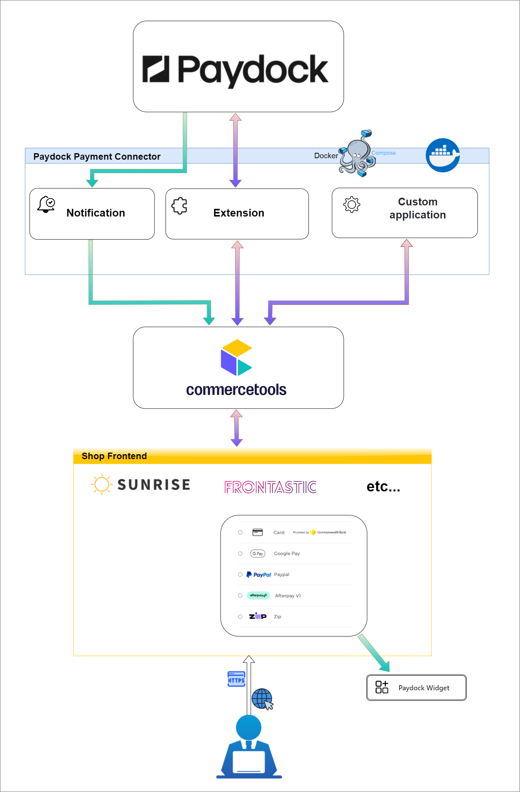

св# Paydock Payment Connector for commercetools

## Overview

The Paydock Payment Connector enables seamless integration between your commercetools platform and Paydock, improving your payment management processes. This repository contains three primary modules:




### Modules

1. **Extension Module**  
   Acts as middleware to connect commercetools with Paydock. It triggers on payment creation and updates within commercetools to ensure efficient event handling by Paydock.
    - [Integration Guide](extension/docs/IntegrationGuide.md): Steps to integrate this module with commercetools.
    - [How to Run](extension/docs/HowToRun.md): Instructions for deploying and running the extension module.

2. **Merchant Center Custom Application**  
   This application allows you to configure both live and sandbox connections to Paydock. Additionally, you can view logs and orders processed through Paydock.
    - [Integration Guide](merchant-center-custom-application/docs/IntegrationGuide.md): Information on integrating this custom application with commercetools.
    - [How to Run](merchant-center-custom-application/docs/HowToRun.md): Instructions for deploying and running the merchant center custom application.

3. **Notification Module**  
   Handles asynchronous notifications from Paydock about payment status changes (e.g., authorization, charge, refund). It updates the corresponding payment status in commercetools.
    - [Integration Guide](notification/docs/IntegrationGuide.md): Information on integrating this module with commercetools.
    - [How to Run](notification/docs/HowToRun.md): Instructions for deploying and running the notification module.

> **Important**: Both the Extension and Notification modules are required to fully integrate your commercetools setup with Paydock.

---

## Environment Variables

This connector consists of three main components, each with its own set of environment variables:

### Merchant Center Custom Application

#### Standard Configuration Variables

| Variable                | Description                          | Required | Default           | Example                              |
|-------------------------|--------------------------------------|----------|-------------------|--------------------------------------|
| `CUSTOM_APPLICATION_ID`  | The Custom Application ID            | Yes      | N/A               | `CUSTOM_APPLICATION_ID=my-app-id`   |
| `CLOUD_IDENTIFIER`       | The cloud identifier                 | No       | `gcp-eu`          | `CLOUD_IDENTIFIER=gcp-eu`            |
| `ENTRY_POINT_URI_PATH`   | The application entry point URI path | Yes      | N/A               | `ENTRY_POINT_URI_PATH=/my-app`       |
| `APP_REGION`             | The commercetools region             | Yes      | `europe-west1.gcp`| `APP_REGION=europe-west1.gcp`        |
| `APP_PROJECT_KEY`        | The commercetools project key        | Yes      | N/A               | `APP_PROJECT_KEY=my-project-key`     |

#### Secured Configuration Variables

| Variable              | Description                        | Required | Example                        |
|-----------------------|------------------------------------|----------|--------------------------------|
| `APP_CLIENT_ID`        | The commercetools client ID        | Yes      | `APP_CLIENT_ID=my-client-id`   |
| `APP_CLIENT_SECRET`    | The commercetools client secret    | Yes      | `APP_CLIENT_SECRET=my-secret`  |

---

### Extension Service

#### Standard Configuration Variables

| Variable                 | Description                   | Required | Default                                    | Example                                   |
|--------------------------|-------------------------------|----------|--------------------------------------------|-------------------------------------------|
| `COMMERCETOOLS_PROJECT_KEY` | The commercetools project key | Yes      | N/A                                        | `COMMERCETOOLS_PROJECT_KEY=my-project-key`|
| `COMMERCETOOLS_API_URL`   | The commercetools API URL     | Yes      | `https://api.europe-west1.gcp.commercetools.com` | `COMMERCETOOLS_API_URL=https://api.commercetools.com` |
| `COMMERCETOOLS_AUTH_URL`  | The commercetools Auth URL    | Yes       | `https://auth.europe-west1.gcp.commercetools.com` | `COMMERCETOOLS_AUTH_URL=https://auth.commercetools.com` |
| `PAYDOCK_API_LIVE_URL`    | Paydock API live URL          | Yes      | N/A                                        | `PAYDOCK_API_LIVE_URL=https://api.paydock.com` |
| `PAYDOCK_API_SANDBOX_URL` | Paydock API sandbox URL       | Yes      | N/A                                        | `PAYDOCK_API_SANDBOX_URL=https://sandbox-api.paydock.com` |

#### Secured Configuration Variables

| Variable                   | Description                        | Required | Example                               |
|----------------------------|------------------------------------|----------|---------------------------------------|
| `COMMERCETOOLS_CLIENT_ID`   | The commercetools client Id        | Yes      | `COMMERCETOOLS_CLIENT_ID=my-client-id`|
| `COMMERCETOOLS_CLIENT_SECRET`| The commercetools client secret    | Yes      | `COMMERCETOOLS_CLIENT_SECRET=my-secret`|

---

### Notification Service

#### Standard Configuration Variables

| Variable                 | Description                   | Required | Default                                    | Example                                   |
|--------------------------|-------------------------------|----------|--------------------------------------------|-------------------------------------------|
| `COMMERCETOOLS_PROJECT_KEY` | The commercetools project key | Yes      | N/A                                        | `COMMERCETOOLS_PROJECT_KEY=my-project-key`|
| `COMMERCETOOLS_API_URL`   | The commercetools API URL     | Yes      | `https://api.europe-west1.gcp.commercetools.com` | `COMMERCETOOLS_API_URL=https://api.commercetools.com` |
| `COMMERCETOOLS_AUTH_URL`  | The commercetools Auth URL    | Yes      | `https://auth.europe-west1.gcp.commercetools.com` | `COMMERCETOOLS_AUTH_URL=https://auth.commercetools.com` |
| `PAYDOCK_API_LIVE_URL`    | Paydock API live URL          | Yes      | N/A                                        | `PAYDOCK_API_LIVE_URL=https://api.paydock.com` |
| `PAYDOCK_API_SANDBOX_URL` | Paydock API sandbox URL       | Yes      | N/A                                        | `PAYDOCK_API_SANDBOX_URL=https://sandbox-api.paydock.com` |

#### Secured Configuration Variables

| Variable                   | Description                        | Required | Example                               |
|----------------------------|------------------------------------|----------|---------------------------------------|
| `COMMERCETOOLS_CLIENT_ID`   | The commercetools client ID        | Yes      | `COMMERCETOOLS_CLIENT_ID=my-client-id`|
| `COMMERCETOOLS_CLIENT_SECRET`| The commercetools client secret    | Yes      | `COMMERCETOOLS_CLIENT_SECRET=my-secret`|


## Commercetools customization

The default commercetools payment type does not include all the necessary fields required for full integration with Paydock. Below is a table that outlines the required custom fields (which are automatically added after installing the connector) to the commercetools payment resource for proper handling of Paydock-specific payment information:

| Field Name                     | Label                             | Type      | Input Hint    | Description                                                                                                                                     |
|---------------------------------|-----------------------------------|-----------|---------------|-------------------------------------------------------------------------------------------------------------------------------------------------|
| `CommercetoolsProjectKey`       | Commercetools project key         | String    | SingleLine    | The commercetools project key                                                                                                                   |
| `PaydockPaymentStatus`          | Paydock payment status            | Enum      | SingleLine    | The status of the payment in Paydock (e.g., paydock-pending, paydock-paid, refunded, etc.)                                                      |
| `PaydockTransactionId`          | Paydock transaction ID            | String    | SingleLine    | Unique identifier of the transaction in Paydock                                                                                                 |
| `PaydockPaymentType`            | Payment type                      | String    | SingleLine    | Type of payment processed via Paydock(Card, PayPal and etc)                                                                                     |
| `CommerceToolsUserId`           | Commerce tools user ID            | String    | SingleLine    | ID of the user in commercetools                                                                                                                 |
| `SaveCard`                      | Save Card                         | Boolean   | SingleLine    | Indicates whether to save the card for future transactions                                                                                      |
| `VaultToken`                    | Vault token                       | String    | SingleLine    | Vault payment token representing user’s payment information                                                                                     |
| `AdditionalInformation`         | Additional information            | String    | MultiLine     | Any additional information relevant to the payment                                                                                              | |
| `RefundedAmount`                | Refunded amount                   | Number    | SingleLine    | The amount refunded via Paydock                                                                                                                 |
| `CapturedAmount`                | Captured amount                   | Number    | SingleLine    | The amount captured from the transaction                                                                                                        |
| `PaymentExtensionRequest`       | Payment extension request         | String    | MultiLine     | Request for generating various operations associated with the payment, such as updating status, retrieving payment methods, make payment and other actions. |
| `PaymentExtensionResponse`      | Payment extension response        | String    | MultiLine     | Response data related to payment extension requests                                                                                             

### Enum Values for `PaydockPaymentStatus`

The `PaydockPaymentStatus` field is an enum with the following possible values:

| Key                     | Label                                |
|--------------------------|--------------------------------------|
| `paydock-pending`        | Pending via Paydock                  |
| `paydock-paid`           | Paid via Paydock                     |
| `paydock-authorize`      | Authorized via Paydock               |
| `paydock-cancelled`      | Cancelled authorize via Paydock      |
| `paydock-refunded`       | Refunded via Paydock                 |
| `paydock-p-refund`       | Partial refunded via Paydock         |
| `paydock-requested`      | Requested via Paydock                |
| `paydock-failed`         | Failed via Paydock                   |
| `paydock-received`       | Received via Paydock                 |
| `paydock-p-paid`         | Partial paid via Paydock             |


### Operations with Custom Fields `PaymentExtensionRequest`

| Key                     | Label                    | Description                                                            |
|-------------------------|-------------------------|------------------------------------------------------------------------|
| `getPaymentMethodsRequest` | Get all available payment methods | **Request**: JSON structure with action and fields.<br>**Response**: Payment methods data. |
| `getVaultTokenRequest`     | Get Vault Token        | **Request**: JSON structure with user details.<br>**Response**: Token data. |
| `getStandalone3dsTokenRequest` | Get Standalone 3ds Token Request | **Request**: JSON structure with payment and user details.<br>**Response**: Token data. |
| `makePayment`           | Make payment              | **Request**: JSON structure with order details.<br>**Response**: Payment status. |
| `makePreCharge`         | Make pre charge           | **Request**: JSON structure with customer and payment data.<br>**Response**: Charge data. |
| `updatePaymentStatus`   | Update payment status      | **Request**: JSON structure with order ID and new status.<br>**Response**: Update confirmation. |


### Examples of Operations with `PaymentExtensionRequest`

####  Get Available Payment Methods

Request:
```json
{
  "custom": {
    "type": {
      "typeId": "type",
      "key": "paydock-components-payment-type"
    },
    "fields": {
      "PaymentExtensionRequest": "{\"action\":\"getPaymentMethodsRequest\",\"request\":{}}"
    }
  }
}
```

Response:
```json
{
  "custom": {
    "type": {
      "typeId": "type",
      "key": "paydock-components-payment-type"
    },
    "fields": {
      "PaymentExtensionResponse": "{\"sandbox_mode\":\"Yes\",\"payment_methods\":{\"card\":{\"name\":\"paydock-pay-card\",\"type\":\"card\",\"title\":\"Card\",\"card_supported_card_schemes\":[{\"value\":\"ausbc\",\"label\":\"Australian Bank Card\"},{\"value\":\"mastercard\",\"label\":\"MasterCard\"}]}}}"
    }
  }
}
```


####  Get Vault Token Request


Request:
```json
{
  "custom": {
    "type": {
      "typeId": "type",
      "key": "paydock-components-payment-type"
    },
    "fields": {
      "PaymentExtensionRequest": "{\"action\":\"getVaultTokenRequest\",\"request\":{\"customerId\":\"*******\",\"paymentMethod\":{\"type\":\"card\",\"cardDetails\":{\"number\":\"********\",\"expiryMonth\":\"12\",\"expiryYear\":\"2025\",\"cvv\":\"123\"}}}}"
    }
  }
}
```
Response:
```json
{
  "custom": {
    "type": {
      "typeId": "type",
      "key": "paydock-components-payment-type"
    },
    "fields": {
      "PaymentExtensionResponse": "{\"status\":\"Success\",\"vaultToken\":\"vault-token-abc123\"}"
    }
  }
}
```

####  Make Payment Request


Request:
```json
{
  "custom": {
    "type": {
      "typeId": "type",
      "key": "paydock-components-payment-type"
    },
    "fields": {
      "PaymentExtensionRequest": "{\"action\":\"makePayment\",\"request\":{\"amount\":100,\"currency\":\"AUD\",\"reference\":\"order-id-456\",\"vaultToken\":\"vault-token-abc123\"}}"
    }
  }
}
```

Response:
```json
{
  "custom": {
    "type": { 
      "typeId": "type",
      "key": "paydock-components-payment-type"
    },
    "fields": {
      "PaymentExtensionResponse": "{\"orderPaymentStatus\":\"Paid\",\"orderStatus\":\"Complete\"}"
    }
  }
}
```


####  Update Payment Status

Request:
```json
{
  "custom": {
    "type": {
      "typeId": "type",
      "key": "paydock-components-payment-type"
    },
    "fields": {
      "PaymentExtensionRequest": "{\"action\":\"updatePaymentStatus\",\"request\":{\"orderId\":\"*******\",\"newStatus\":\"paydock-paid\",\"newDate\":\"2024-09-20 12:07:10\"}}"
    }
  }
}
```

Response:
```json
{
  "custom": {
    "type": {
      "typeId": "type",
      "key": "paydock-components-payment-type"
    },
    "fields": {
      "PaymentExtensionResponse": "{\"status\":true,\"message\":\"Status updated successfully\"}"
    }
  }
}
```

## Additional Resources

- [Paydock Commercetools Widget](https://github.com/PayDock/e-commerce-commercetools-npm)
- [Official Paydock Website](https://paydock.com/)

---

## Contribution

We encourage contributions! Please refer to the [Contribution Guide](docs/Contributing.md) for detailed information on how to contribute and run the modules locally.

---

## License

This project is licensed under the [MIT License](LICENSE).
